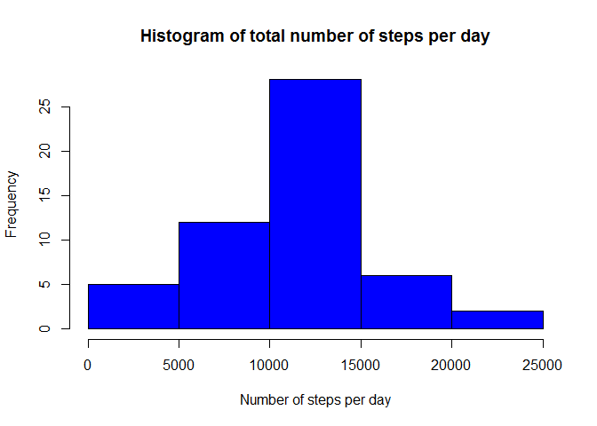
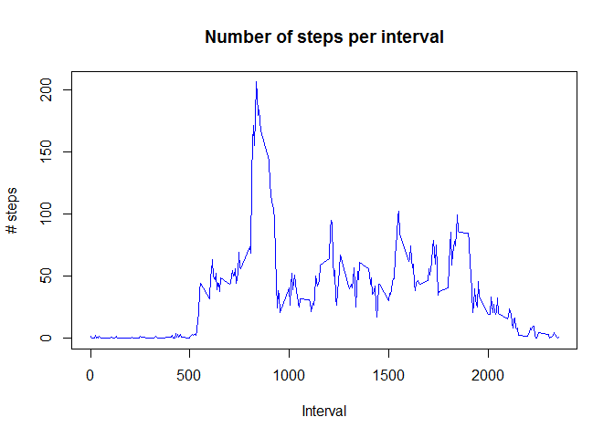

# Reproducible Research: Peer Assessment 1

## Loading and preprocessing the data


```r
file <- "C:/R_env/jh_rppoh/rep_res/activity.csv"
act <- read.csv(file)

act$date <- as.Date(act$date)

act_complete <- act[complete.cases(act),] #ignoring rows with NAs
```

## What is mean total number of steps taken per day?


```r
library(dplyr)
act_complete_day <- act_complete %>% group_by(date) %>%
        summarise(steps_per_day = sum(steps))

hist(act_complete_day$steps_per_day, main="Histogram of total number of steps per day",
     col="blue", xlab="Number of steps per day")
```

 

```r
mean(act_complete_day$steps_per_day)
```

```
## [1] 10766.19
```

```r
median(act_complete_day$steps_per_day)
```

```
## [1] 10765
```

## What is the average daily activity pattern?

There is a clear pattern: hardly any activity in the wee small hours of the morning (apparently very little sleepwalking), after interval 500 (=5am) there is an increase in activity with a distinct peak at interval 835 (=8:35am, rush hours), a mid activity during the day with local maxima and a steady decrease from interval 1900 on towards the 0-steps value around 2400 (midnight).


```r
act_complete_interval <- act_complete %>% group_by(interval) %>%
        summarise(steps_per_interval = mean(steps))

plot(act_complete_interval, type="l", main="Number of steps per interval", col="blue",
     xlab = "Interval", ylab="# steps")
```

 

```r
# Interval for maximum number of steps
act_complete_interval[which(act_complete_interval$steps_per_interval == max(act_complete_interval$steps_per_interval)),1]
```

```
## Source: local data frame [1 x 1]
## 
##   interval
## 1      835
```

## Imputing missing values


## Are there differences in activity patterns between weekdays and weekends?
