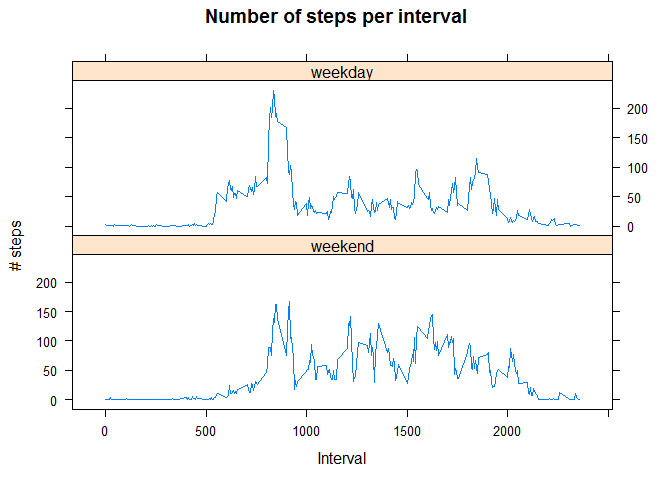

# Reproducible Research: Peer Assessment 1

## Loading and preprocessing the data


```r
file <- "C:/R_env/jh_rppoh/05_rep_res/activity.csv"
act <- read.csv(file)

act$date <- as.Date(act$date)

# add day of the week
Sys.setlocale("LC_TIME", "English")
```

```
## [1] "English_United States.1252"
```

```r
act$day <- weekdays(act$date)

# add day type
act$daytype = "weekday"
act$daytype[act$day == "Saturday"] = "weekend"
act$daytype[act$day == "Sunday"] = "weekend"
act$daytype <- as.factor(act$daytype)

# dataset ignoring rows with NAs
act_complete <- act[complete.cases(act),] 
```

## What is mean total number of steps taken per day?


```r
library(dplyr)
act_complete_day <- act_complete %>% group_by(date) %>%
        summarise(steps_per_day = sum(steps))

hist(act_complete_day$steps_per_day, main="Histogram of total number of steps per day",
     col="blue", xlab="Number of steps per day")
```

 

```r
mean(act_complete_day$steps_per_day)
```

```
## [1] 10766.19
```

```r
median(act_complete_day$steps_per_day)
```

```
## [1] 10765
```

## What is the average daily activity pattern?

There is a clear pattern: hardly any activity in the wee small hours of the morning (apparently very little sleepwalking), after interval 500 (=5am) there is an increase in activity with a distinct peak at interval 835 (=8:35am, rush hours), a mid activity during the day with local maxima and a steady decrease from interval 1900 on towards the 0-steps value around 2400 (midnight).


```r
act_complete_interval <- act_complete %>% group_by(interval) %>%
        summarise(steps_per_interval = mean(steps))

plot(act_complete_interval, type="l", main="Number of steps per interval", col="blue",
     xlab = "Interval", ylab="# steps")
```

 

```r
# Interval for maximum number of steps
act_complete_interval[which(act_complete_interval$steps_per_interval == max(act_complete_interval$steps_per_interval)),1]
```

```
## Source: local data frame [1 x 1]
## 
##   interval
## 1      835
```

## Imputing missing values


```r
# Number of missing values for 'steps' variable
( no_NA <- sum(is.na(act$steps)) )
```

```
## [1] 2304
```

**Strategy**: NAs for 'steps' variable are replaced with the mean for that 5-minute interval.

**Justification and discussion**: on closer inspection of NAs (see code below), it is clear that all missing values come from 8 days for which no data is available at all (device not used/not working properly). Therefore, replacing NA with the mean/median for a given day is not possible. The method chosen makes (some) sense (or at least is possible), however in fact what we do is just substituting those 8 days with interval-means from other days. Best thing would be simply not to take those days into account.


```r
show_NA <- act[!complete.cases(act),]
date_NA <- unique(show_NA$date)
# Number of days for which there was at least 1 NA
length(date_NA)
```

```
## [1] 8
```

```r
# Check if data for all intervals for given days is missing
length(date_NA) * 288 == no_NA
```

```
## [1] TRUE
```

**Imputing NAs**

```r
library(data.table)
act_complete <- data.table(act_complete)
steps_mean_interval <- act_complete[,mean(steps),by=interval]

act_NA_filled <- act
for (i in 1:length(act_NA_filled$steps)) {
        if (is.na(act_NA_filled$steps[i])) {
                act_NA_filled$steps[i] <- steps_mean_interval[
                  steps_mean_interval$interval == act_NA_filled$interval[i],V1]
        }
}

act_NA_filled_day <- act_NA_filled %>% group_by(date) %>%
        summarise(steps_per_day = sum(steps))

# Plotting histograms
par(mfrow = c(1, 2))
hist(act_NA_filled_day$steps_per_day, main="Steps/day | NAs imputed",
     col="forestgreen", xlab="Number of steps per day")

hist(act_complete_day$steps_per_day, main="Steps/day | NAs excluded",
     col="blue", xlab="Number of steps per day", ylim = c(0,35))
```

 

```r
mean(act_NA_filled_day$steps_per_day)
```

```
## [1] 10766.19
```

```r
median(act_NA_filled_day$steps_per_day)
```

```
## [1] 10766.19
```
Impact as expected for the imputing strategy used: histograms similar in shape (with higher middle bin due to 8 more counts for the added days); mean the same; median - shifted towards mean.

## Are there differences in activity patterns between weekdays and weekends?

Two main differences appear:

1. the morning activity is more concentrated during weekdays (one distict peak around 8:35 a.m.; corresponding to rush hours/commuting/pre-work activities) whereas for weekends there seems to be relatively less morning activity and it is spread more evenly,

2. on the whole, during the whole day person seems to be more active on weekends.


```r
library(reshape2)
act_daytype <- dcast(melt(act_NA_filled,measure.vars="steps"),interval+daytype~variable,mean)

library(lattice)
xyplot(steps ~ interval | daytype, data = act_daytype, type = "l",
       index.cond=list(c(2,1)), #this provides the order of the panels
       layout = c(1,2),
       main = "Number of steps per interval",
       xlab = "Interval",
       ylab="# steps")
```

 

